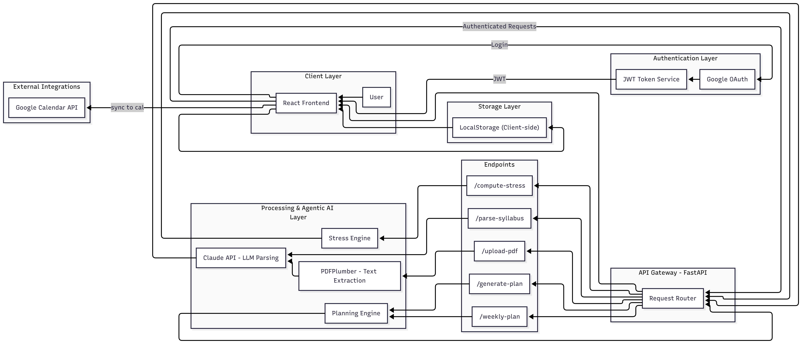
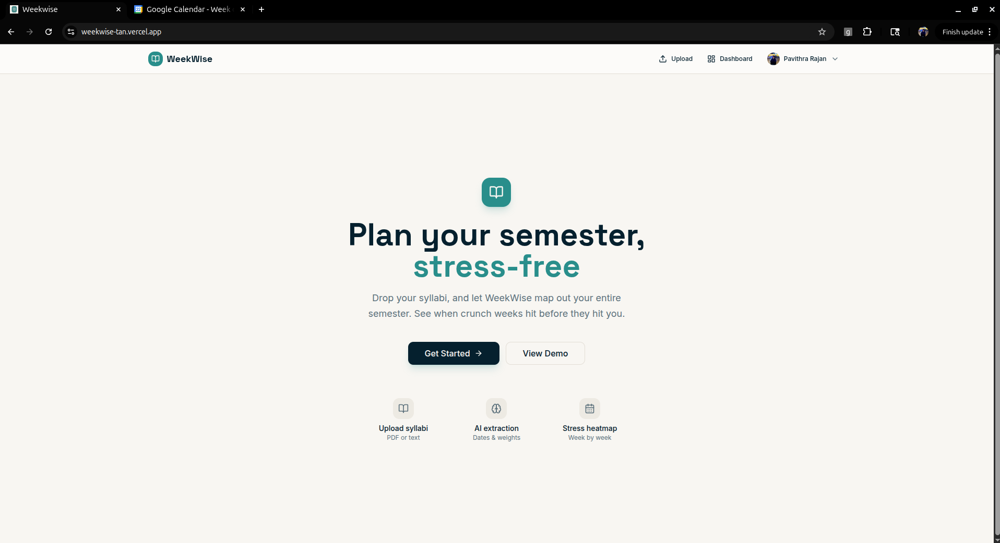
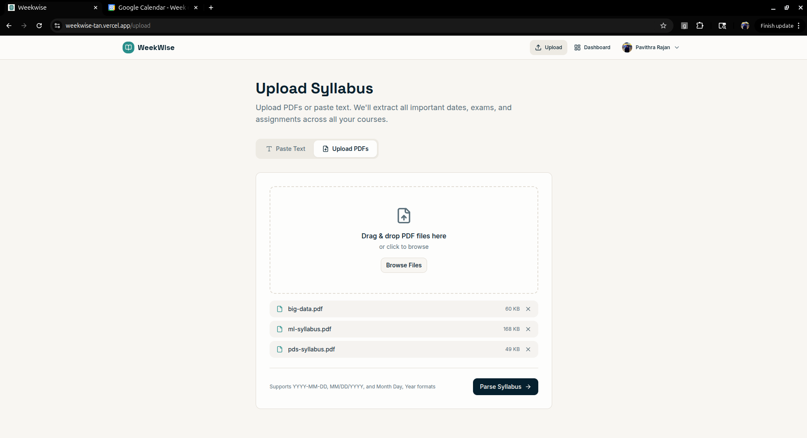
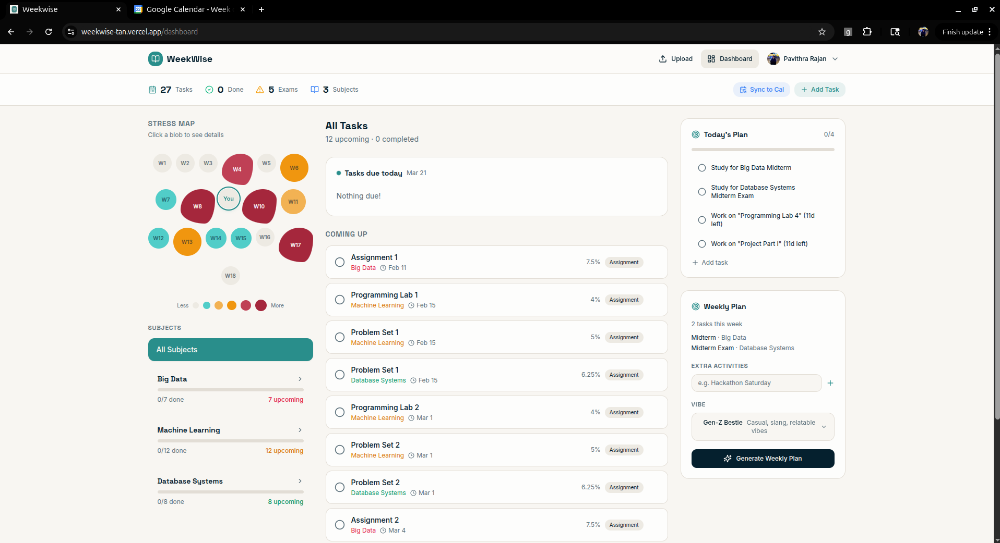
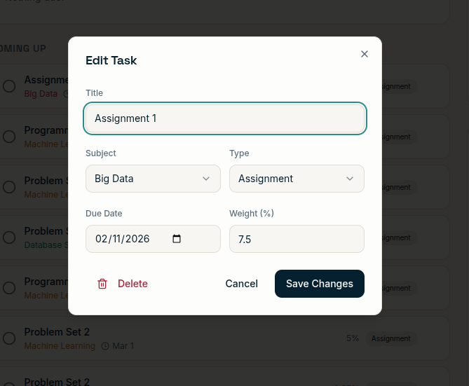
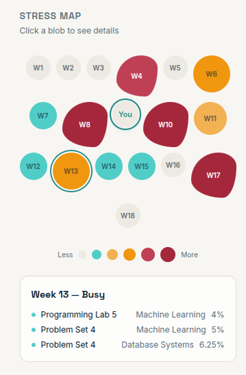
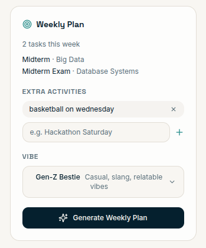
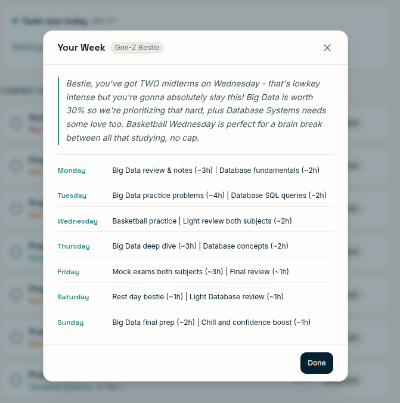
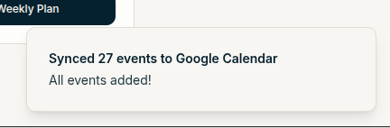

# Weekwise

 

By <a href="https://github.com/annasuzan">Anna Susan Cherian</a> & <a href="https://github.com/Pavithra-Rajan">Pavithra Rajan</a>

## Problem Statement
Students face significant challenges in organizing their academic lives due to the fragmentation of course information across multiple syllabi, platforms, and formats. Manually tracking dozens of deadlines for assignments, exams, and projects often leads to missed dates, increased anxiety, and poor time management. Often enough, some weeks are more hectic than others and there is a need to plan some weeks ahead of time, especially in the middle of a semester or at the end of one. There is a lack of a unified tool that can automatically ingest these documents and translate them into a coherent, stress-aware schedule.

## Motivation
Weekwise was developed to bridge the gap between static academic documents and active personal planning. The goal is to leverage advanced language models to eliminate the tedious work of manual data entry, allowing students to instantly visualize their semester. By providing insights into "stress peaks" and syncing deadlines with existing digital ecosystems, Weekwise empowers students to plan their time better and approach their studies with clarity.

## Features
- **AI-Powered Syllabus Parsing:** Automatically extract tasks, types, and due dates from PDF uploads or raw text using the Claude LLM.
- **Adaptive Timeline:** A dynamic visual representation of upcoming academic obligations organized by date.
- **Stress Heatmap:** A predictive tool that identifies weeks with high assessment density, helping students plan ahead for busy periods.
- **Subject Management:** Categorized views for each course to track subject-specific progress.
- **Manual Task Edits:** Ability to manually add, edit, toggle completion, or delete tasks for complete control over the schedule.
- **Local Persistence:** All event data is stored within the browser to ensure information is retained across sessions.
- **Daily Dashboard:** A focused view of today's priorities and a weekly planner for short-term goal setting.
- **Weekly Planner:** Ability to plan ahead your week depending on your upcoming tasks and any extra curricular tasks. 

## Google Integration
The application uses Google OAuth for secure user authentication. Once authenticated, students can choose to sync their academic events directly to their Google Calendar, ensuring that their study schedule is integrated with their personal and professional commitments.

## Tech Stack
- Frontend: React, Tailwind CSS, Framer Motion (for animations), Lucide React (for iconography).
- Backend: FastAPI, Python 3.12.
- AI Integration: Anthropic Claude API for intelligent syllabus interpretation.
- Document Processing: PDFPlumber for robust text extraction from academic documents.
- Storage: Browser LocalStorage for client-side persistence.

## Architecture
Weekwise follows a decoupled client-server architecture. The FastAPI backend serves as the processing engine, handling heavy-duty text extraction and LLM orchestration. The React frontend serves as the primary interface, managing application state through the Context API and ensuring a responsive user experience. Data flow is designed to be local-first, with the backend acting as a stateless utility for parsing and analysis.

## API Endpoints
| Endpoint | Method | Description |
| :--- | :--- | :--- |
| / | GET | Basic health check endpoint returning application status. |
| /upload-pdf | POST | Combines multiple PDF uploads for full-text extraction using pdfplumber and Claude AI parsing. |
| /parse-syllabus | POST | Extracts and structures academic tasks from provided syllabus text with title, due date, type and subject. |
| /compute-stress | POST | Calculates weekly stress scores to identify critical workload periods. The stress score is a weighted-sum based on the type of task like exams, asignments, etc |
| /weekly-plan | POST | Creates customized weekly study plans based on upcoming tasks and additional tasks if specified by the user. The user can also choose persona to accompany the weekly plan|

## Demo 
### Landing Page

### Upload or Paste Text of your syllabus

### Dashboard

### Edit/Delete tasks for customizability

### Week-wise stress map

### Agentic weekly planner

### Sync to Google Calendar

## Future Plans
1. Database Migration: Transitioning from local storage to Neon Postgres to support cross-device synchronization and more robust data management.
2. Academic API Integration: Connecting directly to Learning Management Systems like Canvas or Blackboard to fetch updates and grades automatically.
3. AI Study Assistant: Implementing personalized study recommendations that suggest optimal times to start working on major projects based on the user's current workload and upcoming deadlines.